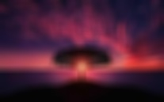
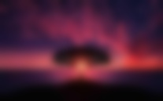
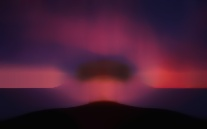
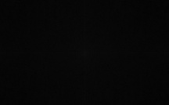

# POPLProjectImgProcBaseline

Implementation for Image Processing Filters using OpenCV in C++.

For the partial fulfillment of the course **CS F301 Principles of Programming Language**.

## Installation Guide

### Installing OpenCV on Ubuntu

1. Install the dependencies

```bash
sudo apt-get install -y build-essential cmake git pkg-config libgtk2.0-dev
```

2. Clone and build the r=source repo by opening terminal and typing the following

```bash
# Clone the repository
git clone https://github.com/opencv/opencv.git

# Build the source.
mkdir -p build && cd build

# Generate the Build Script.
cmake ../opencv

# Build the Source
make -j4

# Install the OpenCV package
sudo make install
```

That’s it. If you did not encounter any error then OpenCV is installed successfully on your Linux system. The header files are at the appropriate location.

### Downloading the code repository -

1. Clone the repository from Github.
```bash
git clone https://github.com/AtharvMane/POPLProjectImgProcBaseline.git
```

2. move to the repository make a directory named bin and make
```bash
cd POPLProjectImgProcBaseline
mkdir bin
make
```


Once you have successfully executed all the steps, now you can run the application using the executables stored in ```./bin``` folder

## Usage - Test Cases

For testing the functionality of the filters we will be using a random internet image

The image is already present in the repository.

To run the program.
```bash
./[binary]
```
For a custom image download the image into the root of the repository, rename it to ```download.jpeg``` and run the command.  
### Example -

1. Contrast and Brightness
```bash
./changing_contrast_and_brightness
```
The above command generates an imahge with changed contrast and brightness depending upon the inputs prompted once the executable runs


2. Adding border
```bash
./addborder
```
The above command creates border around the image in a for loop.


3. filtering
```bash
./custom_filter
```
This command applies a predefined filter in the custom_filter.cpp to the image.




4. Smoothening
```bash
./custom_filter
```
This command smoothens the image according to 3 different algorithms






5. Fourier Transform
```bash
./fourier
```
This command creates a DFT of the image.




5. Drawing
```bash
./drawing_cv
```
This command creates images with predefined drawings.


6. OpenCV Basic Mat
```bash
./understanding_mat
```
Shows the Pointer nature of the cv::Mat container as described in the source doc.

7. Iterating
```bash
./iterating_over_image
```
Thresholds different methods of iteration over an OpenCV image.

